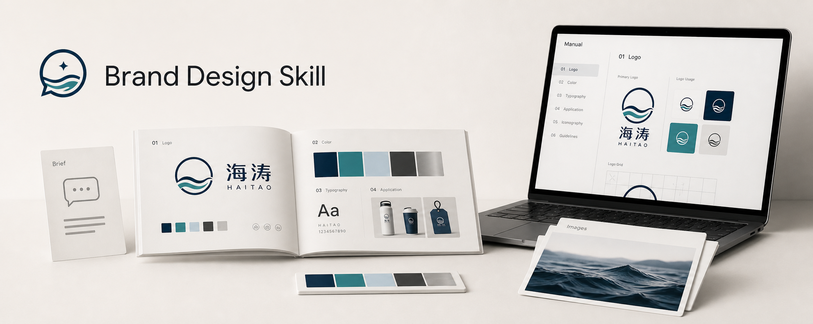
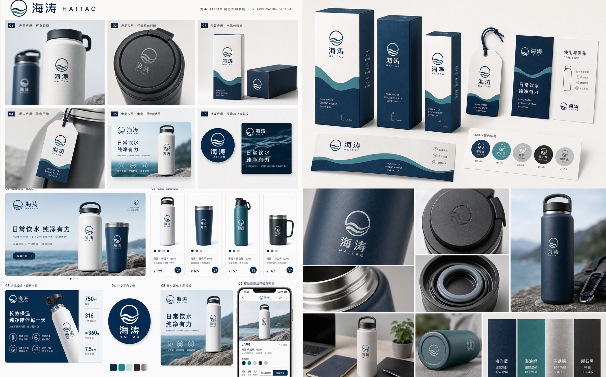

<h1 align="center">Brand Design Skill</h1>

<p align="center">
  A Codex skill for turning rough brand ideas into professional image-first identity systems, VI guidelines, and editable HTML brand manuals.
</p>

<p align="center">
  <a href="README.zh-CN.md">中文</a>
  ·
  <a href="SKILL.md">Skill Prompt</a>
  ·
  <a href="references/design-output-standards.md">Output Standards</a>
  ·
  <a href="examples/haitao/brand-manual.html">Live Example</a>
</p>

<p align="center">
  
</p>

## What It Does

Brand Design Skill helps Codex behave like a senior brand design director, not a quick logo generator. It guides the agent through brand strategy, concept parsing, Socratic clarification, design direction, AI logo image exploration, final image-based logo assets, VI rules, application imagery, and premium HTML brand manuals.

## Highlights

- Converts vague creative briefs into structured brand identity systems.
- Asks clarifying design questions before generating visuals.
- Produces structurally distinct logo image directions.
- Uses an image-first and image-final workflow instead of fragile SVG reconstruction.
- Generates multiple industry-specific application scenes.
- Builds polished HTML manuals with color copy controls, rendered type specimens, image atlas reuse, responsive layout, and restrained microinteractions.
- Preserves image aspect ratios and avoids stretched visual assets.

## Flagship Example

### Haitao Drinkware VI Manual

The current flagship example is a complete workflow for **海涛 HAITAO**, a premium everyday drinkware brand. It includes logo image exploration, final logo image assets, multiple application images, a sprite-like application atlas, and an editable HTML VI manual.

<p align="center">
  
</p>

- HTML brand manual: [`examples/haitao/brand-manual.html`](examples/haitao/brand-manual.html)
- Final logo image assets: [`examples/haitao/final-logo/haitao-final-logo-assets-v1.png`](examples/haitao/final-logo/haitao-final-logo-assets-v1.png)
- Application image atlas: [`examples/haitao/applications/haitao-application-atlas.png`](examples/haitao/applications/haitao-application-atlas.png)
- Full test record: [`examples/haitao/`](examples/haitao/)

## More Examples

- Xiaoya salted duck egg logo exploration: [`examples/xiaoya/generated/logo-contact-sheet-v1.png`](examples/xiaoya/generated/logo-contact-sheet-v1.png)
- Image-first Northwest food VI workflow test: [`examples/xibei/`](examples/xibei/)
- Technology vacuum brand conversational-gate test: [`examples/vacuum-tech2/`](examples/vacuum-tech2/)

## Workflow

```text
rough brief
  -> Socratic clarification
  -> design direction options
  -> logo image generation
  -> user selection/refinement
  -> final logo image assets
  -> VI application images
  -> interactive HTML brand manual
```

The skill is intentionally gated. It should not generate images from an incomplete brief, skip user selection, create SVG logos, or render a final manual before the final logo image assets are approved.

## Repository Structure

```text
brand-design-skill/
├─ SKILL.md
├─ agents/
│  └─ openai.yaml
├─ assets/
│  ├─ banner.png
│  ├─ logo.png
│  ├─ banner.svg
│  ├─ banner-generation-prompt.md
│  └─ logo.svg
├─ examples/
│  ├─ haitao/
│  ├─ xiaoya/
│  ├─ xibei/
│  └─ vacuum-tech2/
└─ references/
   ├─ conversational-workflow.md
   ├─ design-output-standards.md
   └─ industry-and-manual-scope.md
```

## Workflow References

- [references/conversational-workflow.md](references/conversational-workflow.md): dialogue gates and stage behavior.
- [references/industry-and-manual-scope.md](references/industry-and-manual-scope.md): industry adaptation and manual scope.
- [references/design-output-standards.md](references/design-output-standards.md): QA, image asset, HTML, and manual standards.

## Installation

Copy or clone this folder into your Codex skills directory:

```bash
~/.codex/skills/brand-design-skill
```

Then invoke it in Codex with:

```text
Use $brand-design-skill to create a professional brand identity system and HTML brand manual.
```

## Example Prompts

```text
Use $brand-design-skill to design a VI system for a premium drinkware brand.
```

```text
Use $brand-design-skill to create a logo, VI system, application images, and HTML brand manual for a boutique coffee brand.
```

```text
Use $brand-design-skill to turn this rough idea into a premium identity system: a cultural technology studio connecting museums and interactive media.
```

## Star History

Replace `YOUR_GITHUB_USERNAME` with your GitHub account or organization after publishing the repository.

<a href="https://star-history.com/#YOUR_GITHUB_USERNAME/brand-design-skill&Date">
  
</a>

## Contributing

Contributions are welcome. Useful improvements include clearer conversational gates, richer industry playbooks, stronger image-generation asset rules, more polished HTML manual patterns, and realistic example prompts.

## License

Add your preferred open-source license before publishing, such as MIT, Apache-2.0, or CC BY 4.0.
