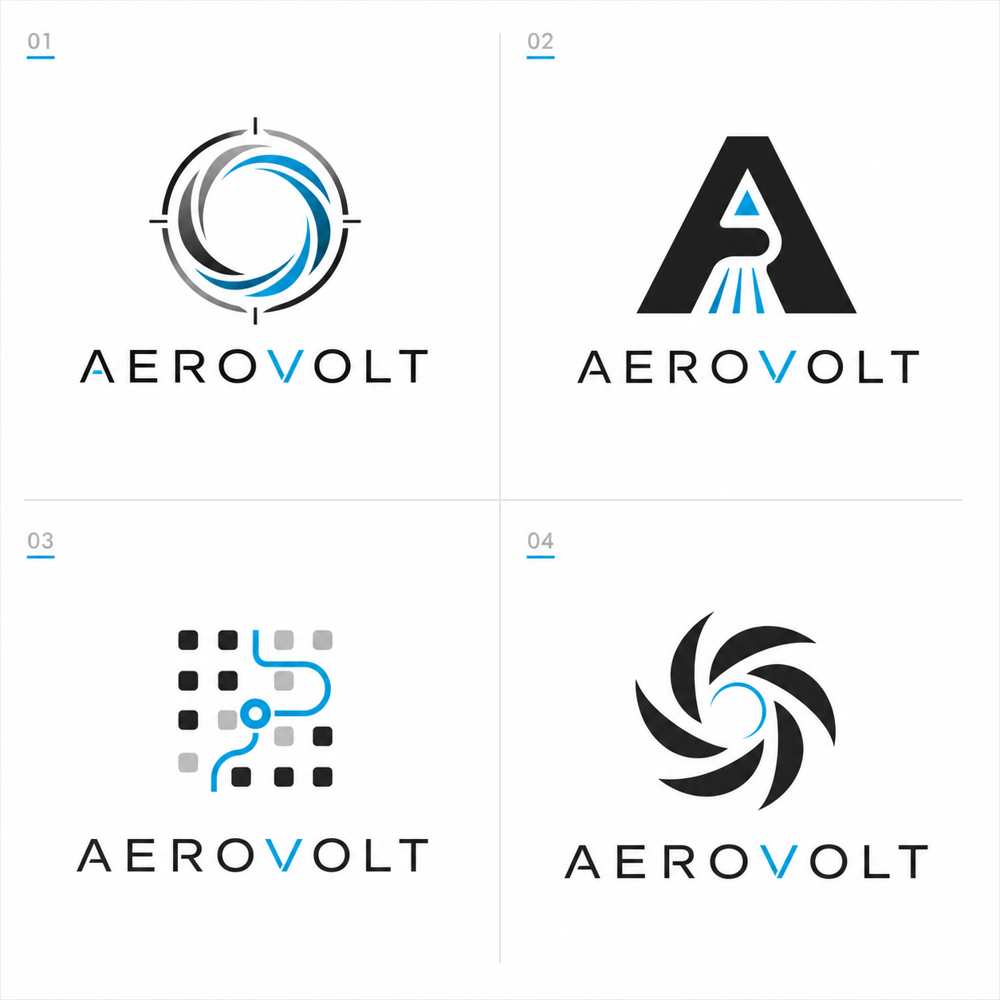

# 04 Logo Image Prompt

This is the exact prompt used with the built-in image-generation tool.

```text
Use case: logo-brand
Asset type: logo exploration contact sheet for a technology vacuum cleaner brand identity
Primary request: Create a professional logo exploration contact sheet for a fictional premium technology vacuum cleaner brand named "AEROVOLT".
Style/medium: high-end brand identity design, flat vector-friendly logo exploration, clean white presentation board, professional design studio quality, no product mockups, no 3D rendering.
Subject: 4 structurally different logo directions for a smart cordless vacuum / cleaning robotics technology brand: (1) airflow vortex + precision ring, (2) negative-space A monogram with suction path, (3) modular sensor grid + clean path, (4) quiet turbine symbol with minimal wordmark.
Composition/framing: four separate logo candidates arranged in a 2x2 contact sheet, each with a simple black or graphite mark and optional minimal wordmark "AEROVOLT"; plenty of whitespace; marks must be scalable and easy to reconstruct as SVG.
Color palette: graphite black, cool white, electric cyan accent, soft silver gray.
Typography direction: refined geometric sans-serif wordmark, premium consumer technology tone, no tiny decorative text.
Constraints: must feel like a professional designer's work for a premium home technology / vacuum cleaner brand; industry-relevant cues should include airflow, suction, cleanliness, precision sensors, quiet power, and smart home engineering.
Avoid: cartoon vacuum icons, literal household clip art, messy gradients, 3D mockups, product renderings, fake UI, excessive detail, unreadable text, generic SaaS logo, watermark.
```

## Generated Asset



## Evaluation Criteria

- Does the direction feel like premium cleaning technology, not generic SaaS?
- Is the logo simple enough to become production SVG?
- Does it communicate airflow, suction, quiet power, or sensor intelligence?
- Can it sit on product hardware without visual noise?
- Does it scale to app icon, product badge, packaging, and instruction manual?
